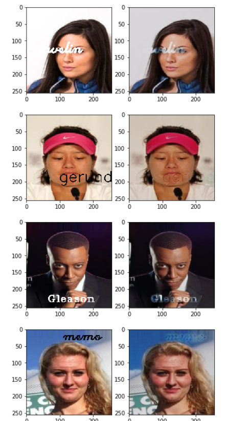

# DeText
A computer vision project which aims to remove text on images

It is a ready-to-run code after downloading data from [here](https://www.kaggle.com/jessicali9530/celeba-dataset) .

# Dependencies

```pip3 install -r requirements.txt```

# Training

Open up a terminal in the main directory and run one of below commands.

If you want to train from scratch:

```bash run_from_scratch.sh ```

If you want to train from scratch:

```bash run_from_pretrained.sh ```

# Notebook

Notebooks are in notebooks folder.

# Data
[CelebFaces Attributes (CelebA) Dataset](https://www.kaggle.com/jessicali9530/celeba-dataset) is used in the project.

This is a repository containing more than 200,000 images of various celebrities.

Download the dataset and put the downloaded zip file in main directory. Then, unzip it.

The directories and files should be listed as below:


# Architecture

UNet is used as architecture. I customized it a little. About 2 million Parameters.
 

# Predictions
Predictions for some testing images are below.


